# Lab Overview

IntegrationHub gives developers, admins and business process owners a centralized place to build and manage integrations. “Content” in IntegrationHub is made up of a series of “Spokes”. Spokes are self-contained scoped applications that contain all of the artifacts that make up an integration, primarily “Actions”.

This lab guide will walk you through the process of creating your first Spoke and will focus on the most common tasks required to build a Spoke from start to finish.

# Create a Scoped Application

Spokes are just Scoped Applications. It’s really that simple. Also, try saying “A Spoke is a Scope” ten times fast ...

The first task when building a new Spoke is to create a Scoped Application.

## Naming your Spoke

When choosing a name for your Spoke, you should keep a few things in mind.

1. The name you give the Spoke (application) will show up in the Action explorer in Flow Designer.
1. To make it easier to distinguish Spoke apps from other apps, add “Spoke” to the end of the application name. When the Spoke is rendered in the Flow Designer UI, the word “Spoke” will be removed.

    **Application Record**:
    

    **Flow Designer UI**:
    

## Create the Spoke

1. Navigate to **System Applications \> Studio**.

    

1. Click the **Create Application** button.
1. Fill out the “Create Application” form with the following values:

    **Name**: London Transit Spoke

    **Scope**: [will be autofilled]
    
1. Click the **Create** button.
1. In the subsequent dialog click the **Continue in Studio (Advanced)** link.
    
1. Click the **London Transit Spoke** entry to open the new application in Studio.
    

## Set the Spoke Icon

When building a Spoke, you can set an icon associated with the application. This will be rendered in the Flow Designer UI. For this lab exercise, you are responsible for finding the image of your choosing.

1. Using Google Images or a similar service, find the icon you wish to use.
2. In Studio, click **File \> Settings**.
    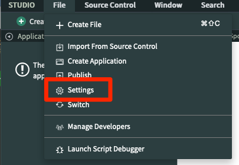
3. Click the **Click to add…** link next to the Logo field.
    
4. Click the **Browse…** button and navigate to the image you chose.
    
5. Click the **OK** button. The image you chose will now be shown.
    

# Create your first Action

Now that you have a scoped app to work with, it’s time to create your first Action. All of the actions you create in this lab will be created **in** the Scope you created.

## Launch Flow Designer

To launch Flow Designer, navigate to **Flow Designer > Designer**.


This opens a new UI where you will manage and build Actions, Flows and Subflows.


## Create the First Action

1. Click the **+ New** button, and then click **Action** in the resulting menu.

    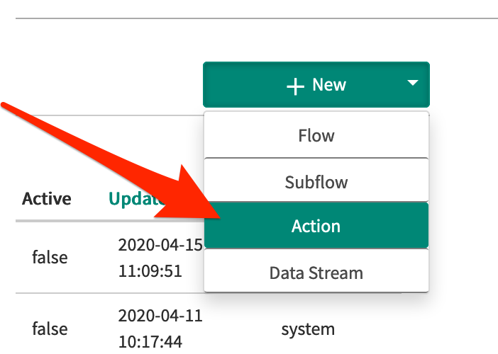

2. Fill out the Action Properties form.

    **Name:** List Valid Modes

    **Application:** London Transit Spoke

    **Description:** Enter a description - simple HTML tags are also supported

    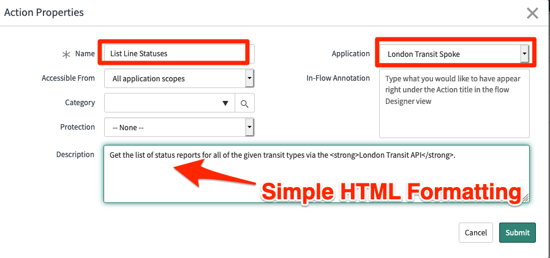

3. Click the **Submit** button and you will be taken to the new/empty Action.

    

## Add a Log step

Actions are made up of a series of steps. You will now add a simple Log step to the action for testing purposes. We’ll add real integration logic to this Action in upcoming exercises.

1. Click the **Add a new step** button (+).
    
2. A new dialog will open with a list of available action steps. Click the **Log** step to add it to the Action.
    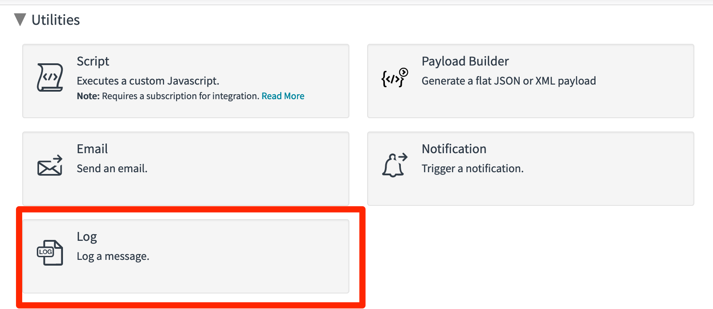
3. Leave the **Log Level** at "Info" and set the **Log Message** field to "Hello, World!".
    
4. Click the **Save** button on the Action. **Do not** click the Publish button yet. We’ll get to that in a bit.

# Create a Test Flow

Now that you have an Action, you need a Flow to test it.

1. Click the **+ New** button, and then click **Flow** in the resulting menu.
    
2. Name the Flow “Test Flow” and click the **Submit** button.
    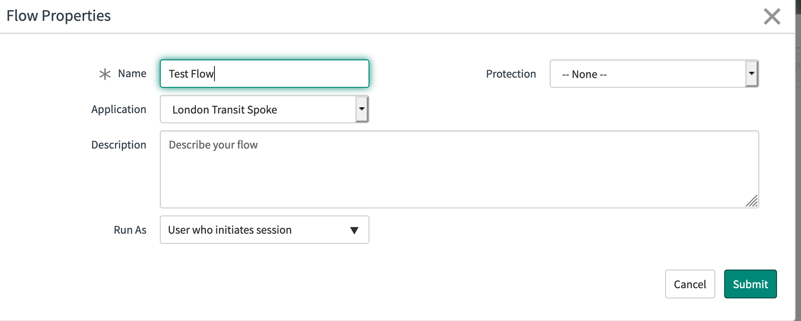

## Add a Trigger

Flows run when a Trigger condition is met. For this test, we will run a flow on a scheduled basis.

1. Click the **Select to add a trigger** button.
    
2. Under the **Date** section, click **Daily**.
    
3. Set to any time and click **Done**.
    

### Enable Draft Actions

By default, only **Published** actions will show up in Flow Designer. Remember when we **didn’t** press the Publish button on the Action? When testing unpublished Actions, you must first enable the option to show draft actions.

1. Click the **More Actions** button (aka the "kebab menu") and click **Configurations**.
    
2. Turn on the **Show draft actions** toggle.
    
3. Close the **Configurations** dialog.

### Add the Action to the Flow

Now it’s time to add your action to the test flow.

1. Click the **Select to add an Action, Flow Logic, or Subflow** link.

    

2. Click the **Action** button.
3. Click the **London Transit** Spoke.
4. Click the **List Valid Modes** Action.
    
5. The Action is now part of the Flow.
    

### Test the Flow

1. To test the flow, click the **Test** button.
    
2. A Dialog will open. Click the **Run Test** button.
    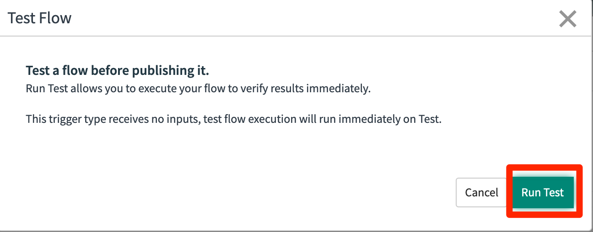
3. Click the **Flow has been executed. To view the flow, click here** link.
    
4. This will open the Execution Details for the test run.
    
5. Click the **List Valid Modes** action to expand details about the execution of that action. Click the **Logs** and **Steps** section to expand them. Note that the Logs section will show all logs generated by the action. The Steps section will show the list of steps executed inside of the action, and the step configuration details such as design time and run time values.
    

# Create a REST Integration

In this exercise, you will integrate to the London Transport API quickly via OpenAPI import and the XML Parser step.

## Import Endpoints via OpenAPI

When integrating to external systems with IntegrationHub, OpenAPI can be a great convenience. This allows for the automatic import of all the endpoints defined in the OpenAPI specification. Not only is this a great timesaver but it increases the quality and efficiency of the integration by guaranteeing correctness of the input and output parameters.

1. Navigate to the tab for the **List Valid Modes** action or reopen if it has been closed.
1. Add a new step above the Log step by clicking the **+** icon above it.
1. Under the **Integrations** section select the **REST** step
 
1. Under the **Request Details** section change the **Build Request** option from **Manually** to **From OpenAPI Specification**. The **Import OpenAPI** button is now visible. Click it.
   
  
1. In the **Import OpenAPI Specification** dialog, ensure that **Import Method** is set to **Manually Populate OpenAPI Content**. Open the [OpenAPI specifiation file](files/london-transport.yaml) in a text editor. Copy the contents and paste into the field **OpenAPI Content**. Click **Import**.
   
1. In the **API Operation** field, type in "*mode" to search on the possible choices that contain that text. Select "Get a list of valid modes" choice.
1. Examine the populated values after the selection is made. The **Resource Path**, **HTTP Method** and **Headers** are automatically filled in.

## Define the REST Integration

With the REST step created, now you will configure the parsing of the return value.

1. Under the REST Step, delete all of the **Accept** header entries except for **text/xml** by clicking the trash can icons to the right.
1. Click the existing **Log** step. Delete the value in the **Log Message** field. From the right side, drag the Data Pill named **Response Body** and drop it in the **Log Message** field.
   
1. Click the **Test**  button. Click the link to open the execution details. Expand the **Steps** section and scroll to the bottom.
   
1. Click the XML text on the right under **Runtime Values**. This will open a dialog viewer that shows the full response body. Select it and either keep on your clipboard or paste somewhere for safe keeping.
   
1. Add a step below the **Log** step by click the **+* icon below it. Choose the **XML Parser** step.
   
1. Paste the XML into the field under **Payload View** then click **Generate Target**.
   
1. You will now see the structure of the pasted XML payload represented as a complex object. Drag the Data Pill for **Response Body** and drop it into **Source Data** field on the left.
   

## Connect to Action Output

Now that the REST Step and XML Parser are configured you will finalize this action by connecting those steps to the action outputs.

1. Click the **Output** section on the left. Click the **Create Output** link.
   
1. There will be a default variable created. Overwrite that with these values:

    **Label**: Modes

    **Name**: modes

    **Type**: Array:Object

    
1. Although you could define the structure of the payload manually, there is a shortcut. Do not edit the child Object. Click **Exit Edit Mode**. Drag the **array_of_mode** Data Pill from the XML Parser section on the right to the **Value** field. DO NOT drag the top-most object, but instead the Array.object child under that.
    
1. Click the **Edit Outputs** button again. Examine the structure automatically created after dropping the data pill.
    
1. Perform a final test of this Action by clicking the **Test** button and looking at the **Execution Details**. Click the payload underneath the **Runtime Value** section to open the viewer.
    
1. Look at the results in the viewer. You should see a parsed version of the XML payload that looks similar to the below.
    

Congratulations! You have created a full integration via OpenAPI and created your first Action that integrates to it.
  
# Define Action Inputs

Action Inputs allow you (and users of Flow Designer) to pass data into your actions. You can think of inputs as method parameters. This section will walk you through the process of creating Action Inputs for the **Get Sentiment Score** action.

## Input Naming Considerations

Action inputs should always have human-friendly names.

**GOOD**: First name
**BAD**: first\_name

**GOOD**: Table Name
**BAD**: tableName

## Add the Input

1. Click the **Inputs** section at the top of the **Action Outline**.
    
2. Click the **Create Input** button.
    
3. Click the “variable” label and change the value to “Text”. Turn the **Mandatory** toggle on.
    
4. Note that there is now a “Text” pill in the **Input Variables** section of the Data pane.
    
5. **Save** the Action.

## Change the Log step to use the input

Now that the action has an input, you will change the Log step to use the value from this input.

1. Open the step named **Log step**.
2. Add a space after the existing log message, and then *drag* the **Text** input to the end of the **Log Message** input.
    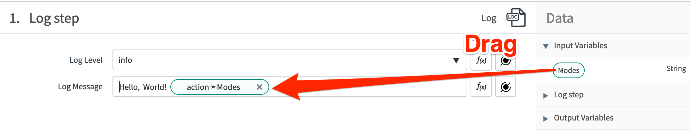
3. **Save** the action.
4. Open the **Test Flow** flow you created earlier.
5. Expand the **Get Sentiment** action and add a value to the new Text input.
    
6. Test the flow again using the steps described earlier, and you will now see the “Text” value in the log message.

# The REST Step

In this exercise, we will use the REST step. The REST step is exclusive to IntegrationHub, and is only available after activating the IntegrationHub Installer plugin. This is already active in your lab instance.

## Add a REST Step to the Action

1. Click the + button underneath the Log step you added earlier.
    
2. Click the REST step in the **Integrations** section of the dialog.
    
3. You will be presented with the REST step UI.
    

### Define Connection Information

When configuring an REST step, there are two options for defining the endpoint you will connect to:

1. Use Connection Alias
2. Define Connection Inline

Whenever possible, you should use a Connection Alias when designing your step. There are two primary reasons to define connections inline:

1. Quick prototyping/testing.
2. When connection info is dynamic and will be passed into the action as an input or otherwise dynamically determined (e.g. the REST step will connect to an address defined in a Configuration Item record passed into the flow).

In this lab, we will start with an inline connection, and convert the action to use a Connection Alias later.

1. Change the **Connection** choice to “Define Connection Inline”.
. Set the **Base URL** to `https://westcentralus.api.cognitive.microsoft.com`
1. Set the **Resource Path** to `/text/analytics/v2.0/sentiment`
1. Make sure there are no leading/trailing spaces in the Base URL an Resource Path fields.
1. Set the **HTTP Method** to “POST”.

### Add Headers

You will add two request headers.

1. Inside the **Headers** widget, click the **+ Add** button.
2. Set the header **Name** to `Content-Type`.
3. Set the header **Value** to `application/json`.
4. Add another header.
5. Set the header **Name** to `Ocp-Apim-Subscription-Key`.
6. Set the header **Value** to the Subscription Key you saved from Microsoft earlier.
7. Again, make sure there is no extra whitespace at the beginning/end of these field values.

The headers widget should now look something like this:


### Set Request Body

Under the **Request Content** section, set the **Request Body** to:

    {
       "documents":  [
            {
                "language": "en",
                "id": "string",
                "text": "I <3 IntegrationHub"
            }
        ]
    }

**Save** the action.

### Test the Action

Using the same steps you followed earlier, test the action again. This time, inspect the details of the REST step. If everything worked correctly, you will see a response from the Sentiment API.


## Data Pills

There’s problem with the REST step you just configured. You hard-coded the message into the Body. Action Designer gives you the ability to include “Data Pills” (those blue things in the Data Pane) inside the Payload.

1. Remove the hard coded message from the “text” property in the payload.
2. With the cursor inside the quotes, click the Data Pill Picker.
    
3. Click **Inputs** and then click the **Text** input you created earlier.
    
4. You should now see the **action -\> Text** data pill inside the “text” property of the payload. If there are any extra spaces between the data pill and the closing quote, remove them.
    
5. **Save** the action.

### Test the Action with the Data Pill in place

Go back to your test flow, and set the input of the flow to the sentence you would like to analyze. Test the flow, and make sure the Action input made it into the Sentiment API call.

# Configure a Connection Alias and Connection

There’s another problem with the action you just built. You hard-coded the connection information into the action, including the Subscription Key. If you were talking to a development system and then moved the action into a production environment, or the subscription key changes, you’d have to modify the action directly, which is definitely not something you should do.

**Connection Aliases** allow you to decouple connection information from the actions you design. They give you the flexibility to build and distribute actions without knowing the connection info beforehand. This gives admins the ability to configure/maintain connections without having to touch the action itself.

## Create a Connection Alias

In this section, you will create a Connection Alias to be used by all of the actions in your spoke.

1. Make sure the correct application is active.
    
2. Navigate to **Connections & Credentials \> Connection & Credential Aliases**.
3. Click **New**.

    

4. Set the following fields:
    - **Name**: CC18\_MS\_Text\_Analytics
    - **Type**: Connection & Credential
    - **Connection type**: HTTP
    
5. Right click the header and click the **Save** button to save the Connection Alias.

    

### Connection Attributes

In addition to the core properties that can be defined in a connection (e.g. endpoint, port, etc.), you can define additional **Connection Attributes** that will be made available to the Actions using that connection alias.

### Define a Connection Attribute

The API we are communicating with requires us to send a **Subscription Key** with every request. This will not be sent as part of a traditional Basic Auth or OAuth credential, so we will use a Connection Attribute to store and access this value.

1. Make sure the Connection Alias you just created is open.
2. Select the **Connection Attributes** tab and click the **New** button.

    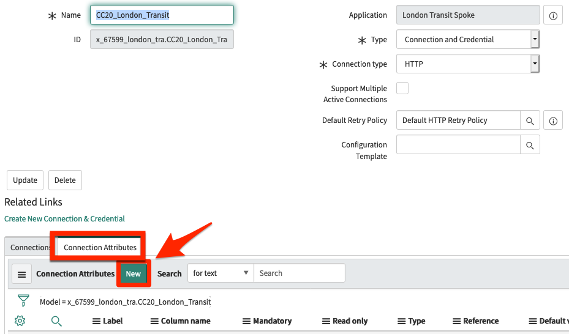

3. Set the following field values:

    **Type:** String
    **Label:** Subscription Key
    **Column name:** \<leave the generated value\>
    **Max length:** 100

    
4. Click the **Submit** button.

## Create a Connection

By itself, an Alias doesn’t do anything. You must define a **Connection** in order to actually use the Alias. In this lab, you will only create a single connection, but imagine a scenario where you have separate connections for a dev, test, and production environment.

1. From the Connection Alias form, switch to the **Connections** tab. Click the **New** button.

    

2. Set the **Name** to “MS Text Analytics (West)”.
3. Set the **Connection URL** to

    `https://westcentralus.api.cognitive.microsoft.com`

4. Under the **Attributes** section, set the **Subscription Key** to the key you obtained earlier in this lab.
5. The form should look something like this:

    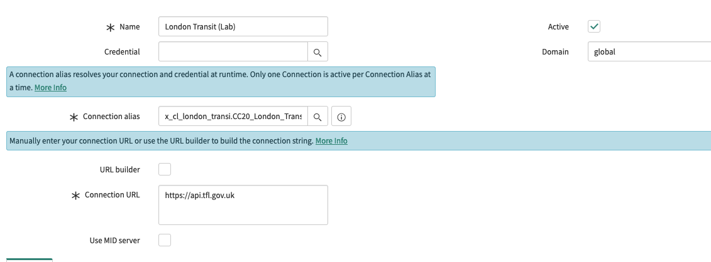

6. Click the **Submit** button to create the connection.

### Update the REST Step to Use the Alias

You must now update the REST step to use the connection Alias and the Subscription Key attribute instead of the hard coded values.

1. Open the REST Step in the Action you created earlier.
2. Change the **Connection** field to “Use Connection Alias”.
3. Set the **Connection Alias** field to the Alias you just created.

    

4. Notice that a new variable called **Subscription Key** is now available in the Data Pane section for the REST Step.

    

5. Remove the hard-coded Subscription Key from the `Ocp-Apim-Subscription-Key` header.
6. Drag the **Subscription Key** data pill from the data pane to the value field.

    

7. **Save** the action.
8. **Test** the action again, and make sure everything still works.

The Action is now fully reusable! You can now pass data into the action, and configure connection / subscription key information without modifying the action.

# The Script Step

Right now, the Action is getting a sentiment score, but isn’t doing anything useful with it. In this exercise, you will use a Script Step to parse the output of the REST step.

Script Steps give you access to the full power of the ServiceNow platform. You can make calls to any server-side scripts (as long as they are available in your scope) and they give you the power to create new kinds of actions that don’t yet exist.

1. Add a new Action Step after the REST step. When prompted, choose the **Script** step.

    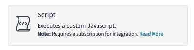

## Script Input Variables

The script step gets its own set of input variables. This allows you to map data from the data pane into script-friendly variables.

1. In the **Input Variables** widget, click the **+ Create Variable** button.
2. Set the **Name** to `responseBody`.
3. Drag the **Response Body** data pill from the data pane to the **Value** field. You can now reference the Response Body in your script as `inputs.responseBody`.

    

4. Set the script to:

```javascript
(function execute(inputs, outputs) {
    var scoreObject = JSON.parse(inputs.responseBody);
    var score = Number(scoreObject.documents[0].score);
    outputs.score = score.toFixed(2);
})(inputs, outputs);
```

## Script Output Variables

You may notice that the script is setting something you haven’t yet defined: `outputs.score`.

Similar to Script Input Variables, Script Output Variables allow you to pass data out of your script to other steps in the action. These variables are internal to the action, and are not surfaced in Flow Designer.

1. In the **Output Variables** widget, click the **+ Create Variable** button.
2. Set the **Name** to “score”.
3. Set the **Type** to “Floating Point Number”.
4. You will now see a new data pill in the **Script step** section of the Data Pane.

# Action Outputs

Use Action Outputs to return data from the action to Flow Designer. The Script Output Variable we just defined is intentionally “private” to the action and is intended for use by scripts or other action steps (thus, the camel case naming convention).

The same naming considerations we used for Action Inputs also apply to Action Outputs. Outputs should always be human readable, use natural language, and should not contain underscores or use variable naming conventions like camelCase.

**GOOD**: Score.
**BAD**: score.

1. Click the **Outputs** section in the **Action Outline**.
2. Click the **+ Create Output** button.
3. Set the **Label** to “Score”.
4. Using the Data Pill Picker, set the **Value** to the “score” Script Output Variable.

    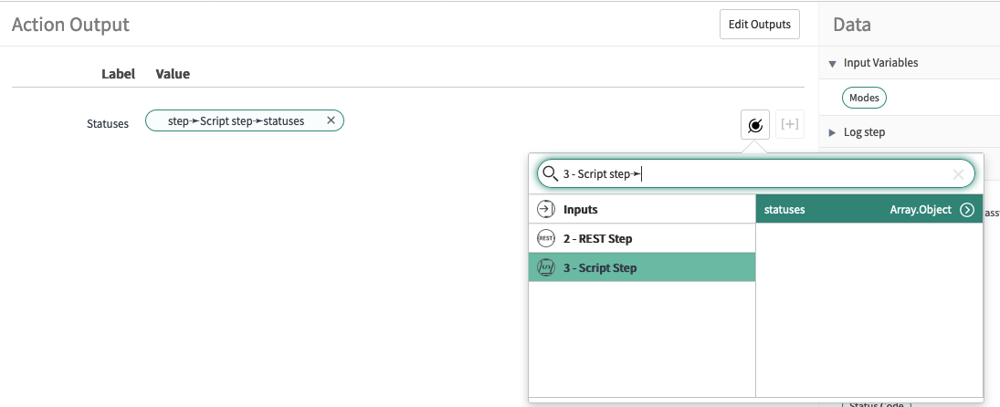

5. **Save** the Action.

## Use the Output

Now that the action is returning the score, you can use it in the Flow. Make the following modifications to the test flow you created.

1. Change the **Text** input on the Get Sentiment Score action to use the **Trigger -\> Incident Record -\> Short description** data pill.
2. Add an **Add Worknote** action to the flow.
3. Set the **Task [Incident]** to the **Trigger -\> Incident Record** data pill.
4. Set the **Work note** to “Sentiment score for incident is: (1 -\> Score)”, where “(1 -\> Score)” is the Score output from the Get Sentiment Score action.

At this point, your flow should look something like this.


## Publish the Action

Run another test, and go check the Incident record to see the work note added by the flow.

If everything looks good, click the **Publish** button on the action to make it available for all flows.

# Challenge Exercise

If you have completed the other exercises early and wish to continue learning, consider implementing a solution to the following use case building on the work you have done thus far.

## Use case

A new team has been formed to handle customer issues. The team is called "Customer Success" and consists of the following team members:

- Abraham Lincoln
- John Adams
- George Washington

Your job is to create a "customer response" record based on sentiment scores below 0.20 and assign it to the customer success team.

Here's a rough outline of things you'll need to do:

1. Create a new customer success group with the members listed above.
1. Create a new customer response table.
1. Use the action you created in your custom spoke to identify records with a given score.
1. Based on that score, create a record in the customer response table.
